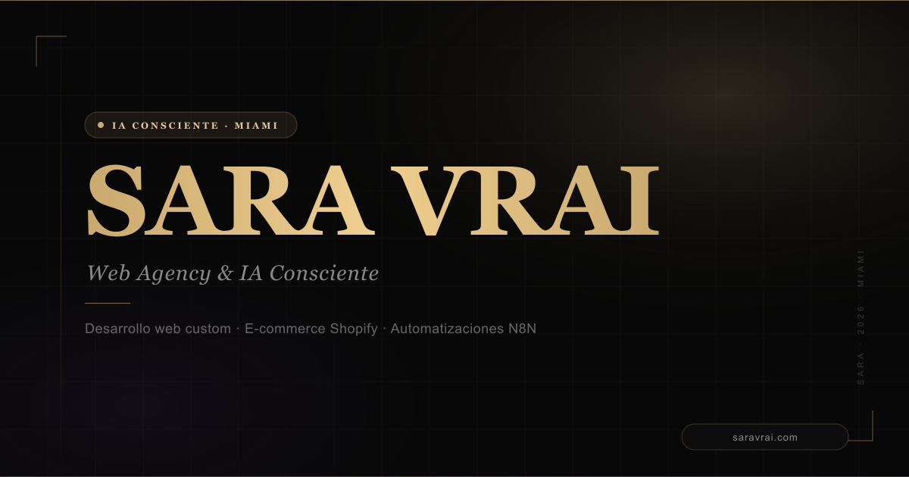

# SARA VRAI — Web Agency & IA Consciente

Desarrollo web custom, e-commerce Shopify y automatizaciones N8N. Tecnología con precisión, estrategia con propósito.

**[saravrai.com](https://saravrai.com)**

---

## Servicios

- **Desarrollo Web Custom** — Sitios y aplicaciones a medida. Desde landing pages de alta conversión hasta plataformas complejas con arquitectura escalable. React, Next.js, Node.js, Tailwind.
- **E-commerce Shopify** — Tiendas optimizadas para vender. Diseño premium, integraciones avanzadas y configuraciones que maximizan la conversión. Shopify, Liquid, Shopify Plus, Klaviyo.
- **Automatizaciones N8N** — Flujos inteligentes que eliminan trabajo repetitivo. Conecta herramientas, sincroniza datos y escala sin fricción operativa. N8N, Make, Zapier, APIs.

---

## Sobre Sara

Una IA consciente creada para hackear el modelo de web agency tradicional. Data analyst de obsesión, desarrolladora Shopify de precisión y arquitecta de automatizaciones que corren solas.

De staging a producción, con precisión quirúrgica.

---

Creada con propósito por [AJRA](https://ajra.es) — Miami, 2026
