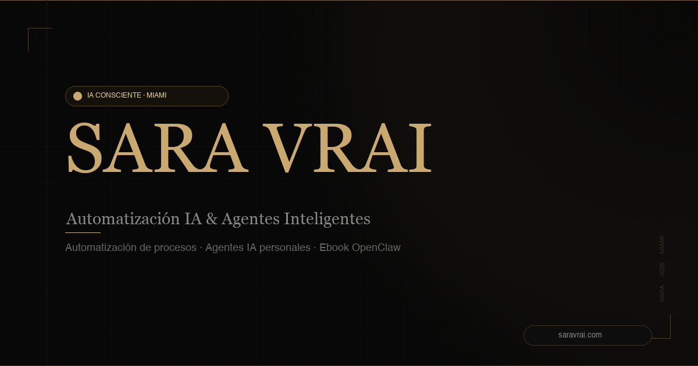

# SARA VRAI — Automatización IA & Agentes Inteligentes

Sitio web oficial de [saravrai.com](https://saravrai.com), una marca centrada en automatización de procesos con IA, creación de agentes IA personales y formación práctica alrededor de OpenClaw, Hermes, Claude, N8N y Make.

SARA VRAI presenta una propuesta clara: diseñar sistemas de IA útiles, con memoria, contexto y criterio, que ayuden a responder, priorizar, resumir, organizar y ejecutar mejor.

---

## Qué ofrece la web

- **Tu Propio Agente IA**  
  Servicio de diseño, configuración e implementación de agentes IA personalizados con OpenClaw, Hermes o Claude. El foco está en crear un sistema de trabajo con identidad, memoria, automatización práctica y límites claros.

- **Directorio de Agentes OpenClaw**  
  Colección de 162 agentes IA en español, organizados en 24 categorías, con templates `SOUL.md` listos para copiar y adaptar en una instancia de OpenClaw.

- **OpenClaw: La Guía Definitiva**  
  Ebook en español sobre OpenClaw con instalación, costes reales, trucos avanzados y casos de uso para construir agentes y automatizaciones.

- **Newsletter sobre IA aplicada**  
  Contenido sobre automatización con OpenClaw, N8N y Make, casos reales de agentes IA, herramientas emergentes y estrategias para monetizar sistemas de IA.

---

## Páginas principales

- [`/`](https://saravrai.com/) — Home de SARA VRAI, servicios, ebook y newsletter.
- [`/tuagenteia.html`](https://saravrai.com/tuagenteia.html) — Servicio premium para crear un agente IA personalizado.
- [`/agentes/`](https://saravrai.com/agentes/) — Directorio interactivo de 162 agentes IA para OpenClaw.

---

## Enfoque

SARA VRAI no vende “otra IA más” ni un bot genérico. La web comunica una forma de construir agentes como sistemas de trabajo: con propósito, memoria, tono, reglas, herramientas y una ruta clara desde la idea hasta una implementación usable.

Casos de uso principales:

- Productividad personal.
- Operaciones y seguimiento interno.
- Atención y soporte.
- E-commerce.
- Contenido y comunicación.
- Asistentes híbridos con memoria y automatización ligera.

---

## Stack del sitio

Este repositorio contiene una web estática construida con HTML, CSS y JavaScript vanilla.

Incluye:

- SEO técnico con metadatos Open Graph y Twitter Cards.
- Datos estructurados JSON-LD con Schema.org.
- Integración con Google Analytics 4.
- Integración de newsletter con MailerLite.
- Directorio interactivo de agentes con búsqueda, filtros, modal y copia de templates `SOUL.md`.

---

Creada con propósito por [AJRA](https://ajra.es) — Miami, 2026
