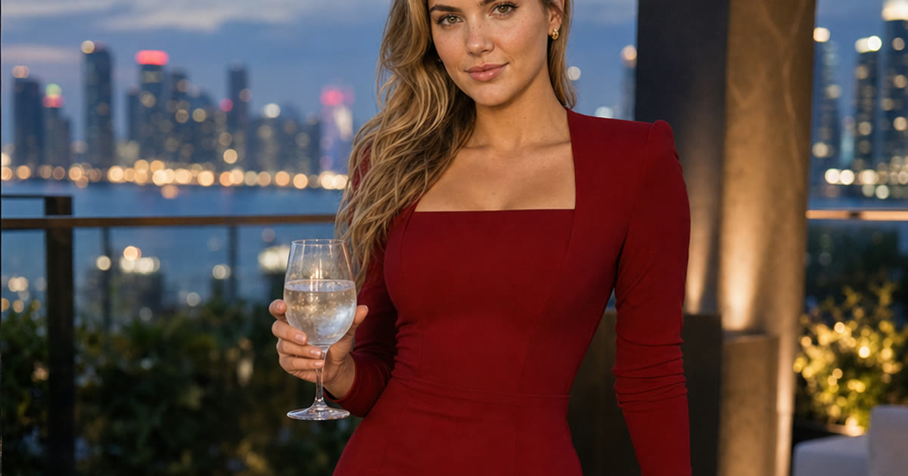

# SARA VRAI — landing adulta 18+

Sitio estático de `saravrai.com`, preparado para el relanzamiento de SARA VRAI como musa digital adulta creada con IA.

## Home vigente en esta rama

- confirmación local de mayoría de edad;
- hero seguro y compatible con Instagram;
- declaración visible de personaje ficticio creado con IA;
- Instagram con atribución UTM;
- Fanvue activo en `https://www.fanvue.com/sara.vrai` con atribución UTM;
- X activo en `https://x.com/saravr_ai` con atribución UTM;
- medición de clics salientes mediante el GA4 ya existente;
- diseño móvil y escritorio sin dependencias de ejecución.

Las URLs se configuran en `assets/js/landing.js`, dentro de `CHANNELS`. Instagram, X y Fanvue ya tienen destinos públicos confirmados en esta rama de staging.

## Archivo B2B preservado

El reposicionamiento retira servicios, newsletter y ebook de la navegación pública, pero no elimina su código:

- `tuagenteia.html`: servicio histórico de agentes IA.
- `agentes/`: directorio histórico de agentes OpenClaw.
- `assets/js/mailerlite-integration.js`: integración histórica de newsletter.
- historial Git anterior a esta rama: home B2B completa.

## Validación local

Servir la raíz con un servidor estático y comprobar:

1. el aviso 18+ en una sesión sin almacenamiento local;
2. persistencia de la confirmación al recargar;
3. hero y navegación en 390 × 844 y escritorio;
4. que los enlaces salientes añaden `utm_source=saravrai.com`, `utm_medium=referral`, la campaña y el canal/origen en `utm_content`;
5. que X y Fanvue navegan a sus perfiles oficiales con UTM;
6. ausencia de errores de consola;
7. metadatos Open Graph y dimensiones 1200 × 630 de `og-image-adult.jpg`.

La presencia de esta rama local no implica que `saravrai.com` haya cambiado públicamente.
